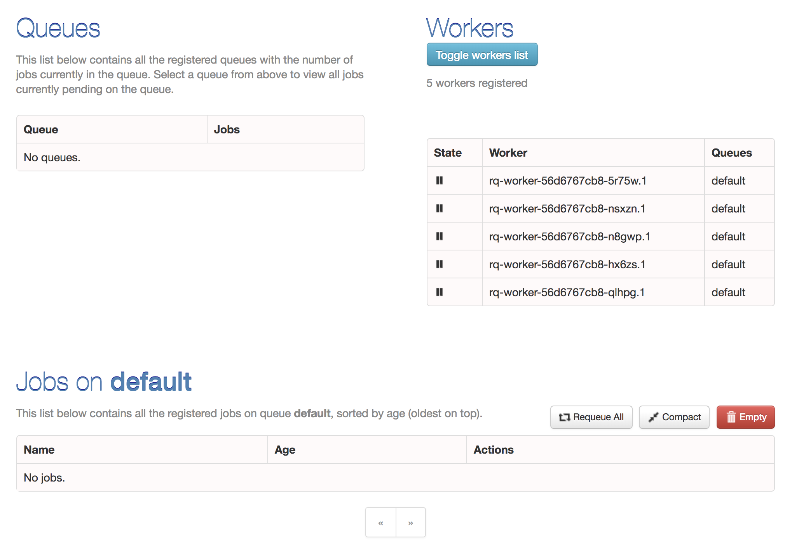

# A Dockerization of Redis Queue

This repository defines a simple Docker image (`jaredv/rq-docker`) that can be
used for either launching a rq dashboard or rq worker. The `docker-compose.yml`
file defines a dashboard container, a worker container and a redis database
container.

To build the Docker image simply run:
```
make image
```

To deploy the stack as part of swarm mode:
```
make deploy-stack
```

Or you can do both steps by simply running:
```
make
```

If you would like to bring down the stack simply run:
```
make kill-stack
```

The dashboard can be viewed by visiting `http://localhost:9181`


